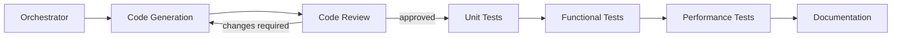

# Construction Phase Agents

Custom Claude Code agents for building a NestJS/TypeScript Experience API through a staged construction pipeline.

## Agents

| Agent | Role | Model |
|---|---|---|
| `construction-orchestrator` | Plans a feature and drives it through all stages | opus |
| `code-generation` | Writes NestJS production code (modules, controllers, services, DTOs, downstream clients) | sonnet |
| `code-review` | Reviews changes for correctness, security, conventions; approves or blocks | opus |
| `unit-test` | Jest unit tests for services, mappers, controllers | sonnet |
| `functional-test` | supertest e2e tests verifying the API contract | sonnet |
| `performance-test` | autocannon load tests against latency/throughput budgets | sonnet |
| `documentation` | Swagger/OpenAPI decorators, README, API docs | haiku |

## Usage

From a Claude Code session in this workspace:

- **Full pipeline** — ask for a feature end-to-end:
  > Build the GET /orders/:id/history endpoint aggregating the orders and shipping services.

  Claude follows the orchestrator pipeline: generate → review → unit test → functional test → perf test → document, verifying each stage before the next.

- **Single stage** — name the task and the matching agent runs alone:
  > Use the code-review agent on src/orders/.

Agent definitions live in [.claude/agents/](.claude/agents/) — edit them to tune conventions, budgets, or models.

## Pipeline flow



## The Experience API service

This repository also contains the service the agents build: a NestJS/TypeScript Experience API (backend-for-frontend). It currently serves employee data read from a local JSON file and publishes interactive OpenAPI docs (Swagger UI) at `/docs`.

### Prerequisites

- Node.js >= 20
- npm

### Install & run

```bash
npm install
npm run start:dev    # development, watch mode
npm run build        # compile to dist/
npm run start:prod   # run the compiled build
```

The server listens on `http://localhost:3000` by default; Swagger UI is at `http://localhost:3000/docs`.

### Test

```bash
npm test             # unit tests (Jest)
npm run test:cov     # unit tests with coverage
npm run test:e2e     # functional tests (supertest)
npm run test:perf    # load test (autocannon)
```

### Environment variables

| Name | Purpose | Example |
|---|---|---|
| `PORT` | HTTP port the server listens on (default `3000`) | `8080` |
| `EMPLOYEES_DATA_PATH` | Path to the employees JSON file, resolved from the working directory (default `data/employees.json`) | `fixtures/staff.json` |

### Endpoints

| Method | Path | Purpose |
|---|---|---|
| GET | `/health` | Liveness check |
| GET | `/employees` | List all employees |

`GET /employees` returns `200` with an array of `{ name, age, department }` — the internal `id` from the data file is never exposed. If the data file is missing or malformed, it returns `500` with `{ "statusCode": 500, "message": "Failed to load employee data", "error": "Internal Server Error" }`.
